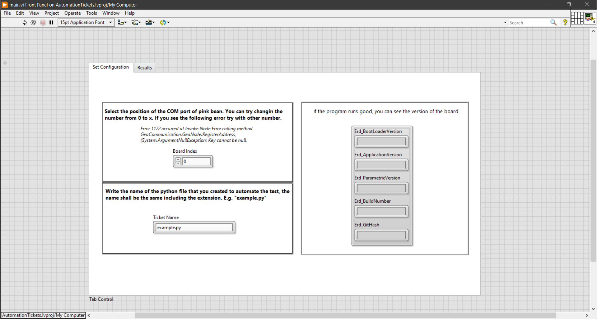

# Tickets Automation Using LabVIEW and Python
This project allow at the user Automate tickets using LabVIEW and python, only adding the steps that you need.

## Project Structure
You need to create a new file .py in the folder "Test", e.g:
- **Folder Project**/
  - **AtTicketsLabView**/
    - On this folder includes all the subVIs of the project.
  - **src**/
    - **DefaultJson**/
      - In this folder you need to add a default Json if you don't want to select a new JSON file and name the JSON like *erd-definitions.json*
    - **Test**/
      - In this folder you need to add the file with the steps of automation ticket. E.g: T230.py
      - Don't care the name and don't care the quantity of files that you add in this folder
    - All files that you don't have to modify it.
    - If you don't select any location to save the file, the file are going to be created here, you could find it as *Results_Date_Hour.csv*
  - **AutomationTickets.lvproj**: this is the project of LabVIEW that contain the necesary Vis to automate ticktes.

## How It Works?
### Python
This program contain some function that you can use to automate test:
- Read ("destination", "Erd", "Expected Data")
- Write("destination", "Erd", "Data To write")
- Wait (Time in seconds, "Text that appear on the screen")
- ActionPassOrFail("Result of physic device, e.g. Verify light turn on")
- ActionDone("Action that you ned to do, e.g. Press and hold the lid")

The structure of the file is the following:
- In the function AtTicket(). You need to write some const before the function
   - T1 = Read ("C0", "'0032", "Expected Data")
- And you need to return the const in a tupple.
   - return [T1]

*See the file called **example.py** on the folder **Test** to see an example*

### LabVIEW
The first step is open the file **AutomationTickets.lvproj**, when the project is appear on the screen open the file **main.vi**, how see in the following image:

  

Once main.vi is open, you only need add the name of the python file created and select the board.

*(main.vi shows more information abour how to use the program)*

#### *NOTE* 
**Don't change the location of any file or rename the files because the program doens't work**

## Requirements
- **Os:** Windows 10 or above
- **Python Version:** See the following link [Compatible version](https://www.ni.com/en/support/documentation/supplemental/18/installing-python-for-calling-python-code.html)
- **LabView Version:** See the following link [Compatible version](https://www.ni.com/en/support/documentation/supplemental/18/installing-python-for-calling-python-code.html)

***The architecture shall be the same, if you install labview 32 bits, python version shall be 32 bits***

- **Python libraries:**
   - csv
   - customtkinter
   - tkinter
   - json

*Install the libraries usign **pip install libraryName** e.g.
 **pip install csv***
